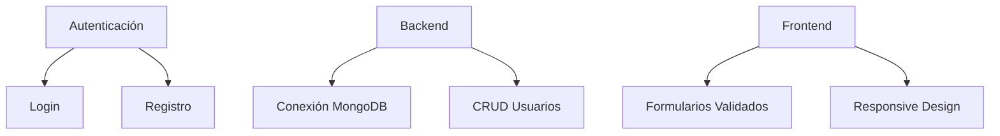

# The Best Health - vAlpha 🏥💻

Aplicación web para gestión integral de salud con 6 módulos especializados. **Versión Alpha** (en desarrollo).

## 🚀 Tecnologías Implementadas
| Frontend               | Backend              | Base de Datos       |
|------------------------|----------------------|---------------------|
|  |  |  |
|  |  |  |

## ✅ Funcionalidades Actuales (vAlpha)

📦 Módulos en Desarrollo

Corazón ❤️ - Monitoreo cardiovascular

Sueño 🌙 - Registro de patrones de sueño

Ejercicio 🏃 - Seguimiento de actividad física

Peso � - Control nutricional

Medicación 💊 - Gestión de medicamentos

Citas Médicas 🗓️ - Agenda de consultas

# Clonar repositorio
git clone https://github.com/RonyMV07/The-Best-Health-vAlpha.git

# Instalar dependencias
cd The-Best-Health-vAlpha
npm install
cd server
npm install

# Variables de entorno (crear .env)
echo "MONGODB_URI=tu_url_de_conexión" >> server/.env
echo "JWT_SECRET=tusecreto" >> server/.env

# Iniciar servidores
npm run dev  
# Frontend
cd ../server && npm start  

# Backend
  gantt
    title Roadmap v1.0
    dateFormat  YYYY-MM-DD
    section Módulos
    Calendario Corazón       :active, 2023-11-01, 14d
    Registro Sueño           :2023-11-15, 10d
    Dashboard Ejercicio      :2023-11-25, 12d

Desarrollador: RonyMV07
Email: (Agregar contacto)
https://img.shields.io/badge/GitHub-100000?style=for-the-badge&logo=github&logoColor=white
