# The Best Health - vAlpha 🏥💻

Aplicación web para gestión integral de salud con 6 módulos especializados. **Versión Alpha** (en desarrollo).

## 🚀 Tecnologías Implementadas
| Frontend               | Backend              | Base de Datos       |
|------------------------|----------------------|---------------------|
|  |  |  |
|  |  |  |

## ✅ Funcionalidades Actuales (vAlpha)

```mermaid
graph TD
    A[Autenticación] --> B[Login]
    A --> C[Registro]
    D[Backend] --> E[Conexión MongoDB]
    D --> F[CRUD Usuarios]
    G[Frontend] --> H[Formularios Validados]
    G --> I[Responsive Design]
```

📦 Módulos en Desarrollo

Corazón ❤️ - Monitoreo cardiovascular

Sueño 🌙 - Registro de patrones de sueño

Ejercicio 🏃 - Seguimiento de actividad física

Peso � - Control nutricional

Medicación 💊 - Gestión de medicamentos

Citas Médicas 🗓️ - Agenda de consultas

# Clonar repositorio
git clone https://github.com/RonyMV07/The-Best-Health-vAlpha.git

# Instalar dependencias
cd The-Best-Health-vAlpha
npm install
cd client
npm install

# Variables de entorno (crear .env)
echo "MONGODB_URI=tu_url_de_conexión" >> server/.env
echo "JWT_SECRET=tusecreto" >> server/.env

# Iniciar servidores
npm run dev  
# Frontend
cd ../client && npm start  

# Backend
cd ../server && node index.js

Desarrollador: RonyMV07
Email: (Agregar contacto)
https://img.shields.io/badge/GitHub-100000?style=for-the-badge&logo=github&logoColor=white
